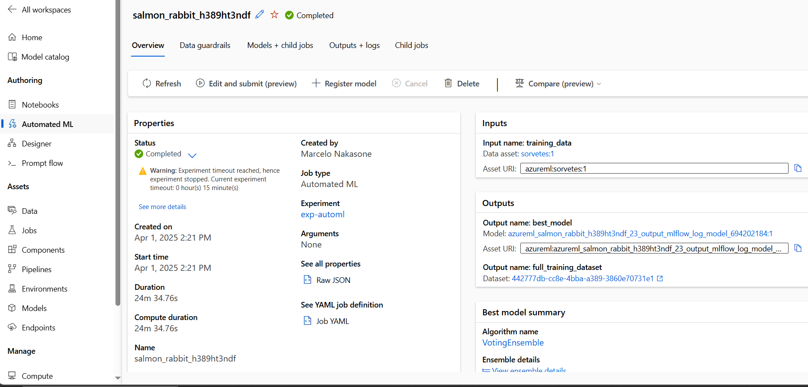
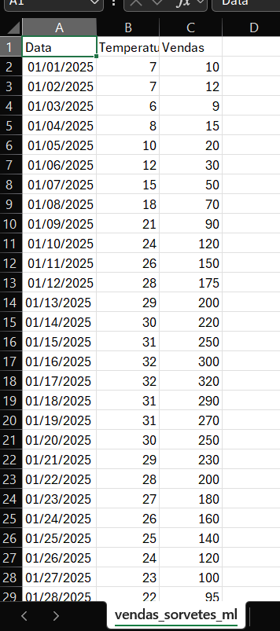
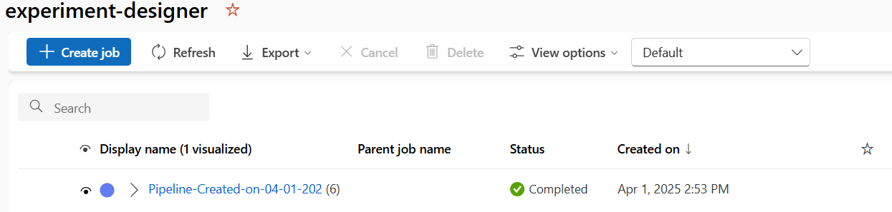
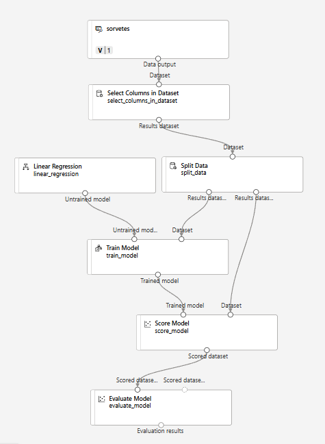
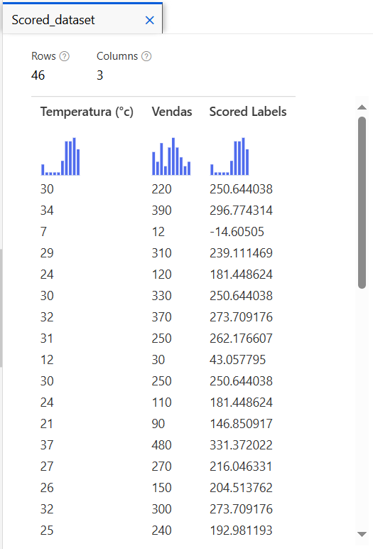

# dio-aml-icecreamsales-lab

Este é um projeto de machine learning baseado no bootcamp da DIO/Microsoft Certification Challenge #3 DP-100

Cenário

Imagine que você é proprietário de uma sorveteria chamada Gelato Mágico, localizada em uma cidade litorânea. Você percebe que a quantidade de sorvetes vendidos diariamente tem uma forte correlação com a temperatura ambiente. No entanto, sem um planejamento adequado, você pode acabar produzindo mais sorvetes do que o necessário e ter prejuízos com desperdícios ou, ao contrário, produzir menos e perder vendas.

Para solucionar esse problema, você decide usar Machine Learning para prever quantos sorvetes serão vendidos com base na temperatura. Com esse modelo, será possível antecipar a demanda e planejar a produção de maneira eficiente.

Solução

Foi criado o Automated ML de nome salmon_rabbit_h389ht3ndf conforme a figura

Este job foi utilizado para progressão regressiva das informações de vendas e temperatura do dia na tabela vendas_sorvetes_ml.csv.

Foi utilizado o Designer para se crira um pipeline estruturado de machine learning

Após treinar o modelo conseguimos alcançar o seguinte resultado

